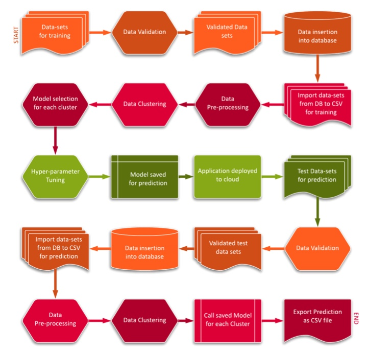

# Data-Science-project-Credit_card_default

To build a classification methodology to determine whether a person defaults the credit card payment for the next month. 

## Overview
### Data

The original dataset is from [Default Payments of Credit Card Clients in Taiwan from 2005]
([Kaggle](https://www.kaggle.com/datasets/uciml/default-of-credit-card-clients-dataset)), 
and I've downloaded it.

This dataset contains information on default payments, demographic factors, credit data, history of payment, and bill statements of credit card clients in Taiwan from April 2005 to September 2005.

The client will send data in multiple sets of files in batches at a given location. 

Features:

1. LIMIT_BAL: continuous.Credit Limit of the person.
2. SEX: Categorical: 1 = male; 2 = female
3. EDUCATION: Categorical: 1 = graduate school; 2 = university; 3 = high school; 4 = others
4. MARRIAGE: 1 = married; 2 = single; 3 = others
5. AGE-num: continuous.
6. PAY_0 to PAY_6: History of past payment. We tracked the past monthly payment records (from April to September, 2005)
7. BILL_AMT1 to BILL_AMT6: Amount of bill statements.
8. PAY_AMT1 to PAY_AMT6: Amount of previous payments.

Target Label:

Whether a person shall default in the credit card payment or not.

9. default payment next month:  Yes = 1, No = 0.

### Results

Our result was satisfactory.

On validation dataset we achieved AUC for xgboost above 90% for all 4 cluster of data.

### Run

Put correct prediction files for prediction at Prediction_Batch_files

Run main.py. 
5002 is default local server. 

>On local UI/Browser Input filepath: Prediction_Batch_files

>On Postman use: {"filepath":"Prediction_Batch_files"}

Files would be saved in Prediction_Output_File

### Architechture

